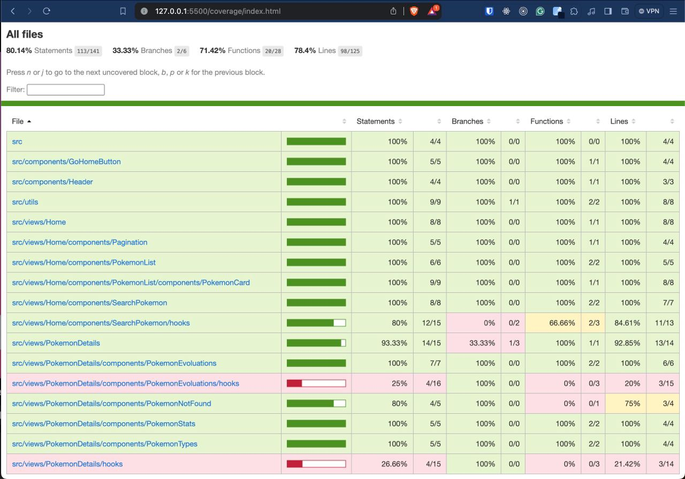

# Pokemon App

This a Pokemon App

## Stack

- [**Vite.js**](https://vitejs.dev/) - Next Generation Frontend Tooling
- [**Typescript**](https://www.typescriptlang.org/) - JavaScript with syntax for types.
- [**Chakra UI**](https://chakra-ui.com/) - Chakra UI: Simple, Modular and Accessible UI Components for your React Applications.

## Files Structure

```
├── node_modules (.gitignore)
├── public
├── src
│   ├── assets
│   ├── components
│   │   ├── GoHomeButton
│   │   │   ├── GoHomeButton.tsx
│   │   ├── Header
│   │   │   ├── Header.tsx
│   ├── utils
│   │   ├── ...
│   │   └── helpers.ts
│   ├── views
│   │   ├── ErrorPage
│   │   └── Home
│   │   └── PokemonDetails
│   ├── constants.ts
│   └── interfaces.ts
│   └── main.tsx
│   └── vite-env.d.ts
├── .eslintrc.cjs
├── .gitignore
├── index.html
├── jest.config.js
└── package-lock.json
├── package.json
└── README.md
└── README.md
└── tsconfig.json
└── tsconfig.node.json
└── vite.config.ts
```

## Prerequisites:

- [Node.js 18+](https://nodejs.org/en/).
- [Git](https://git-scm.com/).

1. [Fork](https://github.com/davilapa/pokedex-app/fork) or [Clone](https://github.com/davilapa/pokedex-app)
   this repository and clone it locally

```bash
git clone git@github.com:<your_username>/pokedex-app.git
```

2. Install dependencies:

```bash
npm install
```

3. run the development server:

```bash
npm run dev
```

Open [http://localhost:5173](http://localhost:5173) with your browser to see the result.

### Coverage
